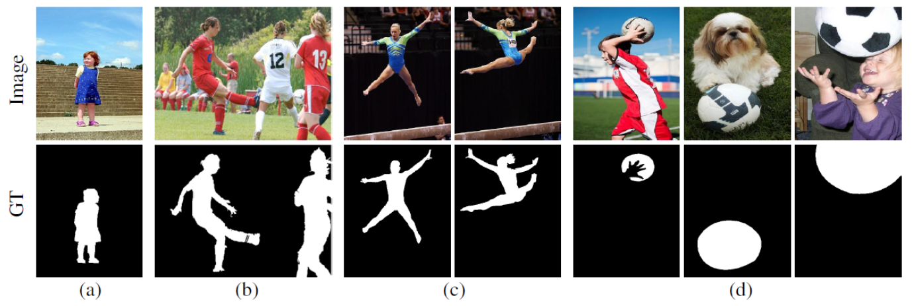
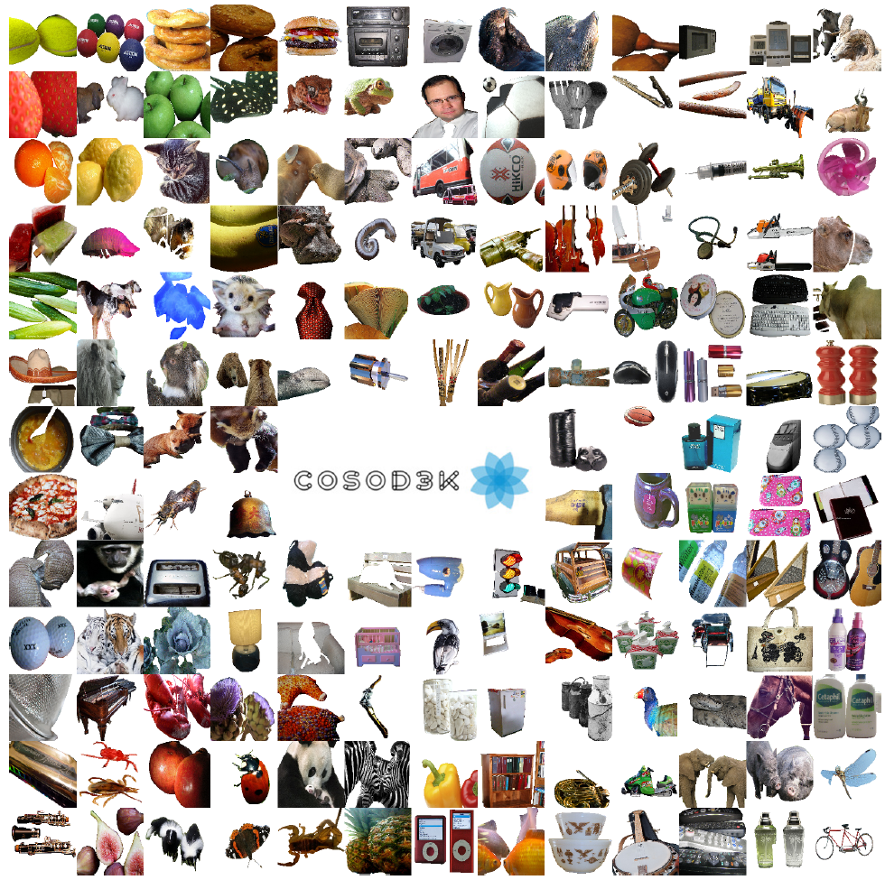
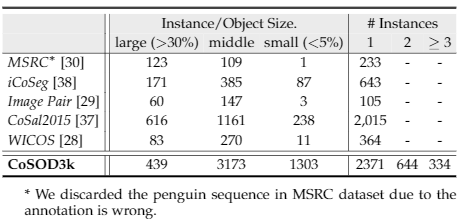

# CoSOD3K (CVPR2020) <a name="headin"></a>

'Taking a Deeper Look at Co-Salient Object Detection'

### Table of Contents
- [CoSOD3K (CVPR2020) <a name="headin"></a>](#cosod3k-cvpr2020-)
	- [Table of Contents](#table-of-contents)
	- [Abstract](#abstract)
	- [CoSOD Dataset Comparision](#cosod-dataset-comparision)
	- [Statistics](#statistics)
	- [Downloads](#downloads)
	- [Usage](#usage)
	- [Results](#results)
	- [Citation](#citation)
## Abstract
Co-salient object detection (CoSOD) is a newly emerging and rapidly growing branch of salient object detection (SOD), which aims to detect the co-occurring salient objects in multiple images. However, existing CoSOD datasets often have a serious data bias, which assumes that each group of images contains salient objects of similar visual appearances. This bias results in the ideal settings and the effectiveness of the models, trained on existing datasets, may be impaired in real-life situations, where the similarity is usually semantic or conceptual. To tackle this issue, we first collect a new high-quality dataset, named CoSOD3k, which contains 3,316 images divided in 160 groups with multiple level annotations, i.e., category, bounding box, object, and instance levels. CoSOD3k makes a significant leap in terms of diversity, difficulty and scalability, benefiting related vision tasks. Besides, we comprehensively summarize 34 cutting-edge algorithms, benchmarking 19 of them over four existing CoSOD datasets (MSRC, iCoSeg, Image Pair and CoSal2015) and our CoSOD3k with a total of ∼61K images (largest scale), and reporting group-level performance analysis. Finally, we discuss the challenge and future work of CoSOD. Our study would give a strong boost to growth in the CoSOD community.

## CoSOD Dataset Comparision
<p align="center">
     <br/>
    <em> 
    Figure 1: Different salient object detection (SOD) tasks. (a) Traditional SOD [78]. (b) Within image co-salient object detection (CoSOD) [93], where common salient objects are detected from a single image. (c) Existing CoSOD, where salient objects are detected according to a pair [52] or a group [85] of images with similar appearances. (d) The proposed CoSOD in the wild, which requires a large amount of semantic context, making it more challenging than existing CoSOD.
    </em>
</p>

<p align="center">
     <br/>
    <em> 
    Figure 2: The 160 Objects from our CoSOD3k.
    </em>
</p>

## Statistics
<p align="center">
     <br/>
    <em> 
    Table 1: Statistics for size and number of instances/objects in existing datasets.’-’ indicates that the dataset only contains object-level annotations, so, the number of instances is only one.
    </em>
</p>

## Downloads
|**Year**|**Publisher**|**Dataset**|**Clips**|**Download Link1**|**Download Link2**|
| :-: | :-: | :-: | :-: | :-: | :-: |
|2010|BMVC|**SegV1**|5(11.9MB)|[Baidu Pan](https://pan.baidu.com/s/1UQ0Lhoc94xwCL0dDUcFQYw)|[Google Driver](https://drive.google.com/open?id=12OslUpBZ61fNh48ksQYp43mt46gxj7k7)|
|2013|ICCV|**SegV2**|14(84.9MB)|[Baidu Pan](https://pan.baidu.com/s/1MywImBeU644Z_qfwUwAxdg)|[Google Driver](https://drive.google.com/open?id=1xQznG6etAtbNEjb1R2ZbjXDD4RCWTHax)|
|2014|TPAMI|**FBMS**|30 (790MB)|[Baidu Pan](https://pan.baidu.com/s/1KwW2-FlF-mkTRD5JRu_aNg)|[Google Driver](https://drive.google.com/open?id=1fOkBR_l1YzZ_eDojDa50ZLD-8Nv5OnJ3)|
|2014|TPAMI|FBMS-59 (overall)|59(817.52MB)|[Baidu Pan](https://pan.baidu.com/s/159WtwxYy3ZDo1kg_K90ogQ)|[Google Driver](https://drive.google.com/open?id=1nmJVBvSRIi-OBaYvDl6PXb5xirENG9F-)|
|2015|TIP|**MCL**|9(308MB)|[Baidu Pan](https://pan.baidu.com/s/1OH9FhK74Km5GM46FZmotwA)|[Google Driver](https://drive.google.com/open?id=1DGrIJM660zj6k67Mfgv7z3K2uIQnVaCs)|
|2015|TIP|**ViSal**|17(59.1MB)|[Baidu Pan](https://pan.baidu.com/s/1s7OwV_wv6VUJV0DBN7Ot8A)|[Google Driver](https://drive.google.com/open?id=1q7I0srSSrlj-78aInbUpPqhHrcdxTZUt)|
|2016|CVPR|**DAVIS**|50(842MB)|[Baidu Pan](https://pan.baidu.com/s/1SlrLuviBez1AkpNl-MzQtA)|[Google Driver](https://drive.google.com/open?id=1slc9rE6stq8ASyl0Mocznx6PLvu_zxOc)|
|2017|TCSVT|**UVSD**|18(207MB)|[Baidu Pan](https://pan.baidu.com/s/1OL6-kOg6y0GPk_pf4ZJ1sw)|[Google Driver](https://drive.google.com/open?id=18Rv4xycxp7MLQHFliuDWUdcRxw2mQOsO)|
|2018|TIP|**VOS**|200(3.33GB)|Baidu Pan|Google Driver|
|||VOS\_test|40(672MB)|[Baidu Pan](https://pan.baidu.com/s/1C1-Zf54Uqor8foaVMgq6xQ)|[Google Driver](https://drive.google.com/open?id=1ld3zHXjMO0I9OJAtIa6Ux-0UA1XfB7dG)|
|2019|CVPR|**DAVSOD**|187(10.24G)|[Baidu Pan](https://pan.baidu.com/s/164sajEdC10-LOxGjCnEuUw) (fetch code: ivzo)|[Google Driver](https://drive.google.com/drive/folders/1BnDF7nB9gPFibx5a8XW5QMc-uyZTTNdA)|
|||All datasets |||[Google Driver](https://drive.google.com/open?id=1AgDKaFESTwpRESqT3XecvWUNHxQYsLg1)


## Citation
If you find this useful, please cite the following work:

```
@inproceedings{fan2020taking,   
  title={Taking a Deeper Look at the Co-salient Object Detection}, 
  author={Fan, Deng-Ping and Lin, Zheng and Ji, Ge-Peng and Zhang, Dingwen and Fu, Huazhu and Cheng, Ming-Ming},   
  booktitle={IEEE CVPR}, 
  year={2020} 
} 
